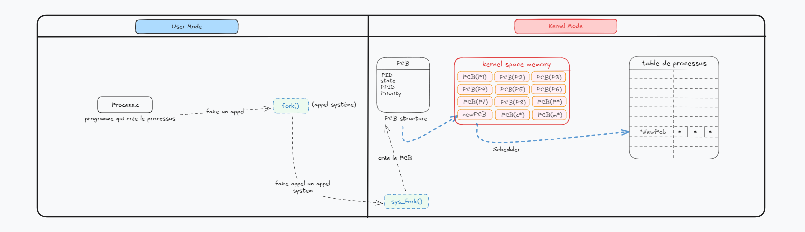

# Linux Process Hiding Simulation (LD_PRELOAD Hooking)

A proof-of-concept userland process hiding and persistence simulation built for Linux systems. This academic project demonstrates how userland rootkits hijack C library calls (`glibc`) using dynamic linker injection (`LD_PRELOAD`) to conceal targeted processes and directories from standard Linux diagnostic utilities like `ps`, `top`, and `ls`.

---

## 📐 Architecture & Execution Flow

The diagram below illustrates the operational difference between standard system process listing and process filtering via library hooking:




### 1. Standard Execution (Top Half)
Under normal execution:
* Diagnostic utilities (such as `ps` or `ls /proc`) request directory and process information via `glibc`.
* `glibc` issues system calls like `getdents64()` to the Linux kernel[cite: 1].
* The kernel populates the directory entry buffer (`*dirp`) from kernel space memory[cite: 1].
* `glibc` returns the full process list to the userland application without filtering[cite: 1].

### 2. Hooked Execution via `Libprochide.so` (Bottom Half)
When `Libprochide.so` is injected using `LD_PRELOAD`[cite: 1]:
* The dynamic linker forces target execution calls to pass through `Libprochide.so` before reaching `glibc`[cite: 1].
* `Libprochide.so` intercepts directory traversal functions (`readdir64()`, `readdir()`, `getdents64()`)[cite: 1].
* The shared library calls the original system API to fetch process data, inspects the returned entries, and strips out entries matching specified target Process IDs (PIDs)[cite: 1].
* The filtered directory structure is returned to the requesting application, effectively concealing the process from monitoring tools[cite: 1].

---

## 🗂️ Project Structure

```text
.
├── sudo/                   # Root-level execution scripts and configurations
│   ├── script/            # Environment setup and teardown scripts (setup.sh, run.sh, cleanup.sh)
│   └── src/               # Shared library source code (hideproc.c, process.c, utils.c)
└── user-space/             # Non-privileged execution environment
    ├── build/             # Compiled binaries
    ├── script/            # Userland execution scripts
    └── src/               # User-space shared library sources
